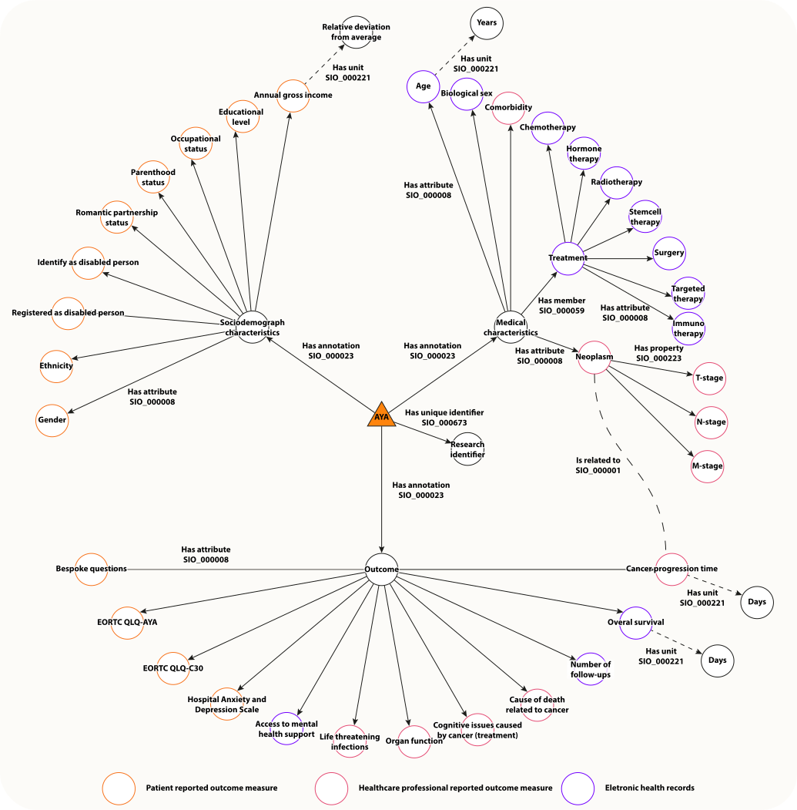
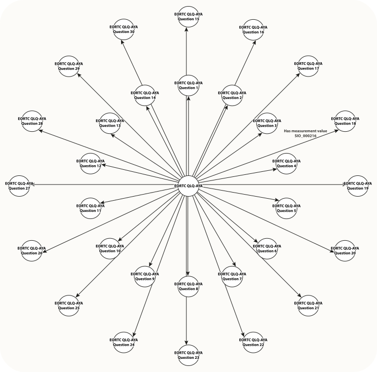

This will be the landing page of the STRONG AYA knowledge representation and codebook.
The page will include
- A brief description of this knowledge representation and its purpose
- Explanation of semantic mapping
- Relation with the knowledge graph

### Knowledge graph
THE STRONG AYA knowledge graphs are separated into three main -non-exhaustive- graphs for clarity, consisting of:
- a data graph
    - _representing a graph of all the different concepts collected for STRONG AYA_.
- a measurement instrument graph
    - _representing a graph for the different measurement instruments used for STRONG AYA.   
        In this case, exemplified through the EORTC QLQ-AYA_.
- an instrument graph
    - _representing a graph for the different instruments used for STRONG AYA.  
        That is for example, a patient reported outcome measure, doctor reported outcome measure, et cetera)_.

#### Data graph

#### Measurement instrument graph

#### Instrument graph
